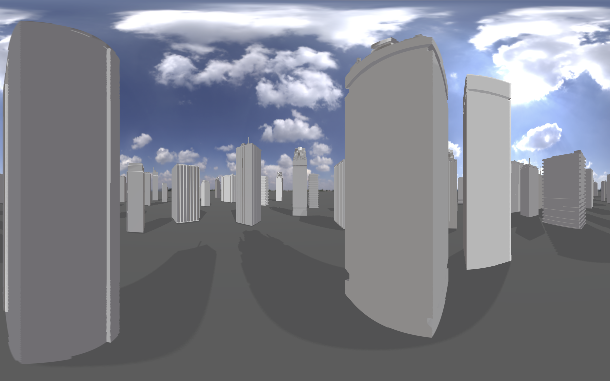

Godot 360 Camera render
=======================
Updated for Godot 4.2

This repository contains an example implementation of rendering a scene to a cubemap and then turning that cubemap into a panoramic image.

Recording the output of this would produce a 360 degree video.

Currently it doesn't yet support stereoscopic rendering so there is no depth perception.

License
=======
The source code presented here has been made available under an MIT license.

Note that some of the assets found in the asset folder fall under licenses from their respective owners:
- all hdriheaven.com images are Creative Commons CC0
- For the free3d buildings asset has a personal use license, please consult: https://free3d.com/3d-model/19-low-poly-buildings-974347.html

About this repository
---------------------
This repository was created by Bastiaan Olij a.k.a. Mux213 - Updated for 4.2 by Victor Stan
